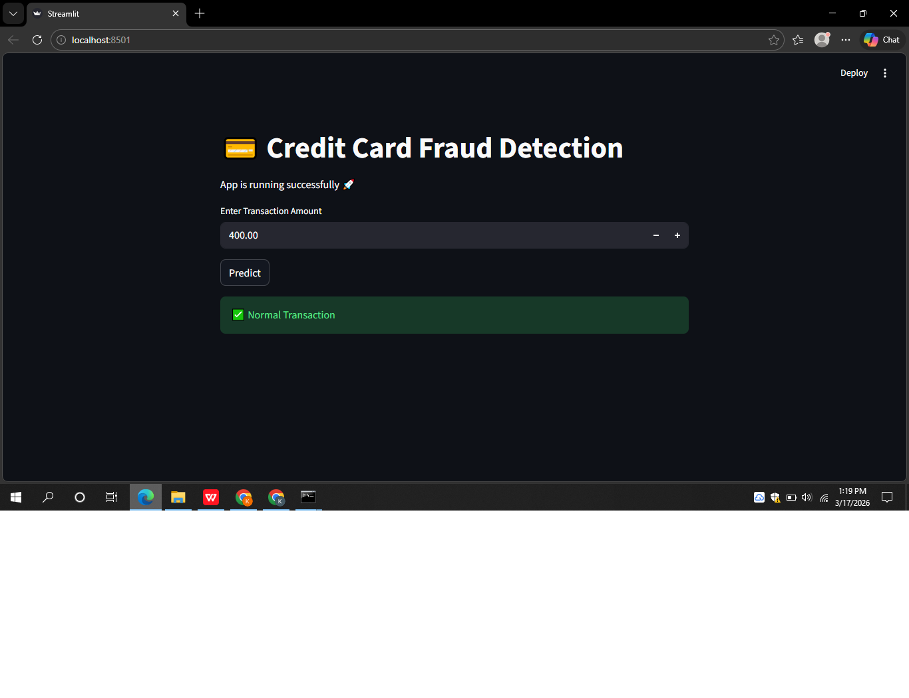

# 💳 Credit Card Fraud Detection

## 🚀 Overview
An end-to-end Machine Learning project to detect fraudulent transactions using advanced ML models and deployed using Streamlit.

## 🔥 Features
- Handles class imbalance using SMOTE
- Models: Random Forest, XGBoost
- Real-time fraud prediction
- Probability-based output
- Streamlit web application

## 🛠 Tech Stack
- Python
- Scikit-learn
- XGBoost
- Streamlit

## 📸 App Preview

## ⚙️ How to Run
pip install -r requirements.txt  
streamlit run app.py  

## 📊 Dataset
Dataset not included due to size.  
Download from:
https://www.kaggle.com/datasets/mlg-ulb/creditcardfraud

## 👨‍💻 Author
Krishna C
